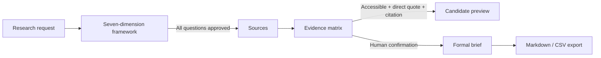

# Embodied Intelligence Research Workbench

[](README.md)
[](README.en.md)

> This README is primarily Chinese; the English version is available in [README.en.md](README.en.md).

[](https://www.python.org/)
[](https://streamlit.io/)
[](tests/)

A research workbench for embodied intelligence industry research, designed for excellent boutique FA interns and junior analysts. It connects the research scope, a seven-dimension question framework, public web sources, an evidence matrix, and research briefs on one auditable chain. Human judgment stays focused on source accessibility, citation quality, methodology, risk, and fact verification.

> This repository is a runnable MVP. Offline demos do not require provider API keys; real-time web research requires a Tavily API key, and Dify workflows are optional enhancements. The project is currently at the single-user, research-validation stage, not a production-grade investment research system.

## Why this project

Embodied intelligence research often requires switching back and forth between search, reports, company documents, and internal notes. The truly time-consuming part is not just writing; it is tracing every conclusion back to an accessible source, checking publication date, region, time range, units, and definitions, and then handling conflicts or evidence gaps.

This MVP structures the repetitive organization work while preserving human research judgment:

- Define the research scope and question framework before starting search.
- Save sources and direct quotations before generating candidate conclusions.
- Present numbers, methodologies, and source conflicts side by side instead of letting the model silently choose.
- A record cannot be confirmed without an accessible source, direct quotation, or citation.
- Candidate previews help inspect structure but cannot be exported.
- Formal briefs use only human-confirmed, traceable evidence.

## Current status

- Product form: single-user Streamlit research terminal.
- Research scope: embodied intelligence, defaulting to a China-centric view while retaining global technology comparisons.
- Offline capabilities: synthetic demo project, local SQLite storage, five-stage navigation, risk-priority evidence matrix, candidate/formal briefs, and Markdown/CSV export.
- Online capabilities: seven-dimension research task creation, custom questions, Chinese/English search query generation per question, Tavily public web search, URL normalization and deduplication, candidate evidence fallback, and optional Dify evidence extraction and brief generation.
- Review process: framework approval, source checks, evidence status confirmation, and formal brief export are all human-controlled.

## Core workflow



The app sidebar contains five stages:

1. **Research Request**: view topic, regional scope, time range, purpose, and project status.
2. **Research Framework**: review questions from seven fixed dimensions; add custom questions (for example, “representative teams”); approve, adjust, or delete each question.
3. **Sources**: inspect source roles, dates, and accessibility; online projects start automatic retrieval from here.
4. **Evidence Matrix**: review facts, direct quotations, citations, and review status sorted by risk priority.
5. **Research Brief**: first generate a pending-review candidate preview that cannot be exported; after facts are confirmed, generate and export the formal brief.

The seven fixed research dimensions are:

- Market definition and boundaries
- Market size and CAGR
- Industry chain and key segments
- Competitive landscape and benchmark companies
- Technology trends and capability evolution
- Financing activities and commercialization progress
- Risks, controversies, and key assumptions

## Evidence and review gates

### Evidence records

Each evidence record contains the factual claim, the related question and dimension, source, publication date, direct quotation, region, time period, unit, definition methodology, risk tags, and review status. The domain model uses immutable Pydantic models, and SQLite handles local persistence.

### What can be confirmed

A record can only move from `pending` to `confirmed` when all of the following are true:

- The source is accessible.
- A non-empty direct quotation exists.
- A source URL or local reference exists.
- The record has not been excluded.

### Automatic risk flags

- `blocked`: source is inaccessible or missing a direct quotation.
- `conflict`: methodology or source conflict exists.
- `possibly_stale`: market/industry-chain materials are older than 24 months; other applicable commercialization materials are older than 12 months; technology, standards, and historical materials are not automatically flagged as stale.
- `incomplete`: market-type records are missing region, time period, unit, or definition methodology.
- `missing_evidence`: the provider did not supply enough evidence to support the record.

Risk tags are used for sorting and human review; they do not automatically replace research judgment.

## Technical architecture

```text
Streamlit UI
├── five-stage pages and state interaction
├── human review gates, KPIs, and risk queue
└── Markdown / CSV downloads

src/
├── domain.py          Pydantic contracts for projects, questions, sources, and evidence
├── storage.py         SQLite schema and WorkbenchRepository
├── online_research.py Tavily / Dify clients, query generation, deduplication, and fallback
├── quality.py         risk determination and risk-priority sorting
├── briefs.py          candidate preview, formal brief, and sentence mapping validation
├── exporting.py       formal Markdown and evidence CSV serialization
├── demo.py            synthetic offline demo project
└── ui.py              terminal theme, header, KPIs, and risk display
```

External provider responsibilities:

- **Tavily**: public web search; results enter the local source and candidate evidence flow.
- **Dify evidence workflow**: optional evidence structuring enhancement; Tavily fallback is kept if it fails.
- **Dify brief workflow**: optional formal brief copy enhancement; falls back to local verifiable Markdown generation if it fails.
- **Streamlit + local code**: owns the final review, risk rules, persistence, mapping validation, and export gate.

## Directory structure

```text
.
├── streamlit_app.py                 # Streamlit entry point and five-stage UI
├── src/                             # domain models, storage, quality, online providers, and export
├── tests/                           # unit tests, AppTest, and provider mock tests
├── dify/                            # Dify workflow DSL, setup guide, and verification script
├── docs/discovery-interviews.md     # target user interviews and question evidence
├── outputs/                         # product design and development docs
├── requirements.txt                 # runtime dependencies
├── requirements-dev.txt             # test and lint dependencies
├── .env.example                     # local environment variable template
└── .streamlit/config.toml           # dark research terminal theme
```

Runtime-generated `data/`, `.venv/`, `.streamlit/secrets.toml`, and local `.env` are excluded by `.gitignore`.

## Local development

### 1. Create a virtual environment and install dependencies

Python 3.12 is required (Python 3.11+ may work, but development and validation are based on 3.12).

```bash
python3 -m venv .venv
.venv/bin/python -m pip install -r requirements-dev.txt
```

### 2. Start the app

```bash
.venv/bin/streamlit run streamlit_app.py
```

After opening the local address printed by Streamlit:

1. Click **Load Demo Research** in the sidebar, or create an online research task first (see below).
2. Browse through “Research Request → Research Framework → Sources → Evidence Matrix → Research Brief”.
3. Try confirming qualifying evidence and handling risk records in the evidence matrix.
4. View the candidate preview, formal brief gate, and download buttons on the Research Brief page.

The sidebar's **Select Existing Project** can reopen projects already stored in local SQLite (including the demo project and any online projects you have created). After an app restart, the last project is not automatically restored; use this option to continue previous work.

The offline demo uses synthetic sources and synthetic quotations and does not represent real industry data.

## Online research configuration

The app reads configuration from process environment variables by default and also supports Streamlit Secrets. It does not automatically load a `.env` file; if you use a local `.env`, load it explicitly:

```bash
cp .env.example .env
set -a
source .env
set +a
.venv/bin/streamlit run streamlit_app.py
```

Variables in `.env.example`:

| Variable | Required | Purpose |
| --- | --- | --- |
| `DIFY_BASE_URL` | No | Dify API URL, default `https://api.dify.ai/v1` |
| `TAVILY_API_KEY` | Required for live search | Enables Tavily public web search |
| `DIFY_PLAN_API_KEY` | No | Reserved planning workflow config; current version generates the seven-dimension framework locally |
| `DIFY_EVIDENCE_API_KEY` | No | Enables Dify evidence structuring enhancement |
| `DIFY_BRIEF_API_KEY` | No | Enables Dify formal brief copy enhancement |
| `ONLINE_RESEARCH_TIMEOUT` | No | Provider request timeout in seconds, default `60` |
| `APP_DB_PATH` | No | SQLite path, default `data/workbench.sqlite3` |

Configuration behavior:

- Without `TAVILY_API_KEY`: the offline demo still runs, but online research tasks show a configuration block.
- With only `TAVILY_API_KEY`: web search works, and candidate evidence is generated using the local fallback.
- Adding `DIFY_EVIDENCE_API_KEY`: tries to structure evidence with Dify and falls back to Tavily excerpts on failure.
- Adding `DIFY_BRIEF_API_KEY`: the formal brief may use Dify-generated copy and falls back to local Markdown on failure.

Do not commit real keys to the repository, README, test fixtures, or logs. If using Streamlit Secrets, write the same variables to the local `.streamlit/secrets.toml`; that file is ignored.

## Tests and quality checks

Tests do not call real Tavily, Dify, or other providers; online paths use mock transports and local temporary SQLite.

```bash
# Full test suite
.venv/bin/python -m pytest -q

# Code quality
.venv/bin/ruff check .
```

Test coverage includes:

- Pydantic domain models and evidence confirmation gates.
- SQLite restart recovery, source exclusion, and evidence status.
- Candidate preview and formal brief status filtering.
- Markdown / CSV export eligibility.
- Market field completeness, stale risk, blocked evidence, and risk sorting.
- Streamlit AppTest for five-stage navigation, KPIs, risk, and brief pages.
- Tavily query generation, URL deduplication, Dify blocking workflow requests, JSON output parsing, missing configuration, and online fallback.

## Iteration versions

The release branch is `codex/offline-workbench`; each milestone is preserved in Git history:

| Version | Node | Highlights |
| --- | --- | --- |
| `v0.1.0-offline` | `1967e60` | Offline research workbench, SQLite, evidence review, and export |
| `v0.2.0-terminal` | `2ad4266` | Research terminal UI, KPIs, risk queue, and five-stage navigation |
| `v0.3.0-online` | `4b695bd` | Tavily search, Dify adapter, and online research run |
| `v0.3.1-fallback` | `40e3f33` | Provider fallback, timeout, and error recovery |
| `v0.4.0-readme` | Final docs commit | Complete run instructions and release index |

Release nodes are fast-forward ordered; do not force-push over history.

## Project documentation

- [MVP product design specification](outputs/2026-08-10-embodied-intelligence-research-workbench-design.md)
- [Product development document](outputs/2026-08-11-embodied-intelligence-product-development-document.md)
- [User discovery interviews](docs/discovery-interviews.md)
- [Offline MVP design](docs/superpowers/specs/2026-08-12-offline-workbench-design.md)
- [Offline MVP implementation plan](docs/superpowers/plans/2026-08-12-offline-workbench.md)
- [Research terminal UI design](docs/superpowers/specs/2026-08-13-research-terminal-ui-design.md)
- [Online research workflow design](docs/superpowers/specs/2026-08-14-online-research-workflow-design.md)
- [Online research workflow implementation plan](docs/superpowers/plans/2026-08-14-online-research-workflow.md)
- [Cloud Dify setup guide](dify/setup-guide.md) (import workflow DSL, get keys, verify scripts)
- [README and release design](docs/superpowers/specs/2026-08-14-versioned-github-release-readme-design.md)

---

