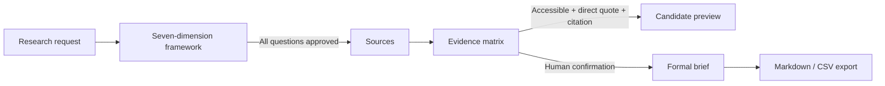
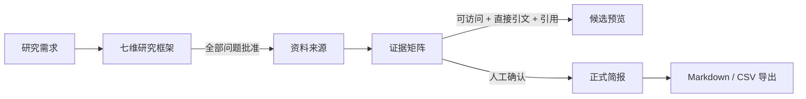

# Embodied Intelligence Research Workbench / 具身智能研究工作台

> **Bilingual README**: English first, followed by the complete Chinese version.
> **中英双语说明**：本文件先提供英文版，后附完整中文版。

[](https://www.python.org/)
[](https://streamlit.io/)
[](tests/)

---

## English

### Embodied Intelligence Research Workbench

A research workbench for embodied intelligence industry research, designed for excellent boutique FA interns and junior analysts. It connects the research scope, a seven-dimension question framework, public web sources, an evidence matrix, and research briefs on one auditable chain. Human judgment stays focused on source accessibility, citation quality, methodology, risk, and fact verification.

> This repository is a runnable MVP. Offline demos do not require provider API keys; real-time web research requires a Tavily API key, and Dify workflows are optional enhancements. The project is currently at the single-user, research-validation stage, not a production-grade investment research system.

### Why this project

Embodied intelligence research often requires switching back and forth between search, reports, company documents, and internal notes. The truly time-consuming part is not just writing; it is tracing every conclusion back to an accessible source, checking publication date, region, time range, units, and definitions, and then handling conflicts or evidence gaps.

This MVP structures the repetitive organization work while preserving human research judgment:

- Define the research scope and question framework before starting search.
- Save sources and direct quotations before generating candidate conclusions.
- Present numbers, methodologies, and source conflicts side by side instead of letting the model silently choose.
- A record cannot be confirmed without an accessible source, direct quotation, or citation.
- Candidate previews help inspect structure but cannot be exported.
- Formal briefs use only human-confirmed, traceable evidence.

### Current status

- Product form: single-user Streamlit research terminal.
- Research scope: embodied intelligence, defaulting to a China-centric view while retaining global technology comparisons.
- Offline capabilities: synthetic demo project, local SQLite storage, five-stage navigation, risk-priority evidence matrix, candidate/formal briefs, and Markdown/CSV export.
- Online capabilities: seven-dimension research task creation, custom questions, Chinese/English search query generation per question, Tavily public web search, URL normalization and deduplication, candidate evidence fallback, and optional Dify evidence extraction and brief generation.
- Review process: framework approval, source checks, evidence status confirmation, and formal brief export are all human-controlled.

### Core workflow



The app sidebar contains five stages:

1. **Research Request**: view topic, regional scope, time range, purpose, and project status.
2. **Research Framework**: review questions from seven fixed dimensions; add custom questions (for example, “representative teams”); approve, adjust, or delete each question.
3. **Sources**: inspect source roles, dates, and accessibility; online projects start automatic retrieval from here.
4. **Evidence Matrix**: review facts, direct quotations, citations, and review status sorted by risk priority.
5. **Research Brief**: first generate a pending-review candidate preview that cannot be exported; after facts are confirmed, generate and export the formal brief.

The seven fixed research dimensions are:

- Market definition and boundaries
- Market size and CAGR
- Industry chain and key segments
- Competitive landscape and benchmark companies
- Technology trends and capability evolution
- Financing activities and commercialization progress
- Risks, controversies, and key assumptions

### Evidence and review gates

#### Evidence records

Each evidence record contains the factual claim, the related question and dimension, source, publication date, direct quotation, region, time period, unit, definition methodology, risk tags, and review status. The domain model uses immutable Pydantic models, and SQLite handles local persistence.

#### What can be confirmed

A record can only move from `pending` to `confirmed` when all of the following are true:

- The source is accessible.
- A non-empty direct quotation exists.
- A source URL or local reference exists.
- The record has not been excluded.

#### Automatic risk flags

- `blocked`: source is inaccessible or missing a direct quotation.
- `conflict`: methodology or source conflict exists.
- `possibly_stale`: market/industry-chain materials are older than 24 months; other applicable commercialization materials are older than 12 months; technology, standards, and historical materials are not automatically flagged as stale.
- `incomplete`: market-type records are missing region, time period, unit, or definition methodology.
- `missing_evidence`: the provider did not supply enough evidence to support the record.

Risk tags are used for sorting and human review; they do not automatically replace research judgment.

### Technical architecture

```text
Streamlit UI
├── five-stage pages and state interaction
├── human review gates, KPIs, and risk queue
└── Markdown / CSV downloads

src/
├── domain.py          Pydantic contracts for projects, questions, sources, and evidence
├── storage.py         SQLite schema and WorkbenchRepository
├── online_research.py Tavily / Dify clients, query generation, deduplication, and fallback
├── quality.py         risk determination and risk-priority sorting
├── briefs.py          candidate preview, formal brief, and sentence mapping validation
├── exporting.py       formal Markdown and evidence CSV serialization
├── demo.py            synthetic offline demo project
└── ui.py              terminal theme, header, KPIs, and risk display
```

External provider responsibilities:

- **Tavily**: public web search; results enter the local source and candidate evidence flow.
- **Dify evidence workflow**: optional evidence structuring enhancement; Tavily fallback is kept if it fails.
- **Dify brief workflow**: optional formal brief copy enhancement; falls back to local verifiable Markdown generation if it fails.
- **Streamlit + local code**: owns the final review, risk rules, persistence, mapping validation, and export gate.

### Directory structure

```text
.
├── streamlit_app.py                 # Streamlit entry point and five-stage UI
├── src/                             # domain models, storage, quality, online providers, and export
├── tests/                           # unit tests, AppTest, and provider mock tests
├── dify/                            # Dify workflow DSL, setup guide, and verification script
├── docs/discovery-interviews.md     # target user interviews and question evidence
├── outputs/                         # product design and development docs
├── requirements.txt                 # runtime dependencies
├── requirements-dev.txt             # test and lint dependencies
├── .env.example                     # local environment variable template
└── .streamlit/config.toml           # dark research terminal theme
```

Runtime-generated `data/`, `.venv/`, `.streamlit/secrets.toml`, and local `.env` are excluded by `.gitignore`.

### Local development

#### 1. Create a virtual environment and install dependencies

Python 3.12 is required (Python 3.11+ may work, but development and validation are based on 3.12).

```bash
python3 -m venv .venv
.venv/bin/python -m pip install -r requirements-dev.txt
```

#### 2. Start the app

```bash
.venv/bin/streamlit run streamlit_app.py
```

After opening the local address printed by Streamlit:

1. Click **Load Demo Research** in the sidebar, or create an online research task first (see below).
2. Browse through “Research Request → Research Framework → Sources → Evidence Matrix → Research Brief”.
3. Try confirming qualifying evidence and handling risk records in the evidence matrix.
4. View the candidate preview, formal brief gate, and download buttons on the Research Brief page.

The sidebar's **Select Existing Project** can reopen projects already stored in local SQLite (including the demo project and any online projects you have created). After an app restart, the last project is not automatically restored; use this option to continue previous work.

The offline demo uses synthetic sources and synthetic quotations and does not represent real industry data.

### Online research configuration

The app reads configuration from process environment variables by default and also supports Streamlit Secrets. It does not automatically load a `.env` file; if you use a local `.env`, load it explicitly:

```bash
cp .env.example .env
set -a
source .env
set +a
.venv/bin/streamlit run streamlit_app.py
```

Variables in `.env.example`:

| Variable | Required | Purpose |
| --- | --- | --- |
| `DIFY_BASE_URL` | No | Dify API URL, default `https://api.dify.ai/v1` |
| `TAVILY_API_KEY` | Required for live search | Enables Tavily public web search |
| `DIFY_PLAN_API_KEY` | No | Reserved planning workflow config; current version generates the seven-dimension framework locally |
| `DIFY_EVIDENCE_API_KEY` | No | Enables Dify evidence structuring enhancement |
| `DIFY_BRIEF_API_KEY` | No | Enables Dify formal brief copy enhancement |
| `ONLINE_RESEARCH_TIMEOUT` | No | Provider request timeout in seconds, default `60` |
| `APP_DB_PATH` | No | SQLite path, default `data/workbench.sqlite3` |

Configuration behavior:

- Without `TAVILY_API_KEY`: the offline demo still runs, but online research tasks show a configuration block.
- With only `TAVILY_API_KEY`: web search works, and candidate evidence is generated using the local fallback.
- Adding `DIFY_EVIDENCE_API_KEY`: tries to structure evidence with Dify and falls back to Tavily excerpts on failure.
- Adding `DIFY_BRIEF_API_KEY`: the formal brief may use Dify-generated copy and falls back to local Markdown on failure.

Do not commit real keys to the repository, README, test fixtures, or logs. If using Streamlit Secrets, write the same variables to the local `.streamlit/secrets.toml`; that file is ignored.

### Tests and quality checks

Tests do not call real Tavily, Dify, or other providers; online paths use mock transports and local temporary SQLite.

```bash
# Full test suite
.venv/bin/python -m pytest -q

# Code quality
.venv/bin/ruff check .
```

Test coverage includes:

- Pydantic domain models and evidence confirmation gates.
- SQLite restart recovery, source exclusion, and evidence status.
- Candidate preview and formal brief status filtering.
- Markdown / CSV export eligibility.
- Market field completeness, stale risk, blocked evidence, and risk sorting.
- Streamlit AppTest for five-stage navigation, KPIs, risk, and brief pages.
- Tavily query generation, URL deduplication, Dify blocking workflow requests, JSON output parsing, missing configuration, and online fallback.

### Iteration versions

The release branch is `codex/offline-workbench`; each milestone is preserved in Git history:

| Version | Node | Highlights |
| --- | --- | --- |
| `v0.1.0-offline` | `1967e60` | Offline research workbench, SQLite, evidence review, and export |
| `v0.2.0-terminal` | `2ad4266` | Research terminal UI, KPIs, risk queue, and five-stage navigation |
| `v0.3.0-online` | `4b695bd` | Tavily search, Dify adapter, and online research run |
| `v0.3.1-fallback` | `40e3f33` | Provider fallback, timeout, and error recovery |
| `v0.4.0-readme` | Final docs commit | Complete run instructions and release index |

Release nodes are fast-forward ordered; do not force-push over history.

### Project documentation

- [MVP product design specification](outputs/2026-08-10-embodied-intelligence-research-workbench-design.md)
- [Product development document](outputs/2026-08-11-embodied-intelligence-product-development-document.md)
- [User discovery interviews](docs/discovery-interviews.md)
- [Offline MVP design](docs/superpowers/specs/2026-08-12-offline-workbench-design.md)
- [Offline MVP implementation plan](docs/superpowers/plans/2026-08-12-offline-workbench.md)
- [Research terminal UI design](docs/superpowers/specs/2026-08-13-research-terminal-ui-design.md)
- [Online research workflow design](docs/superpowers/specs/2026-08-14-online-research-workflow-design.md)
- [Online research workflow implementation plan](docs/superpowers/plans/2026-08-14-online-research-workflow.md)
- [Cloud Dify setup guide](dify/setup-guide.md) (import workflow DSL, get keys, verify scripts)
- [README and release design](docs/superpowers/specs/2026-08-14-versioned-github-release-readme-design.md)

---

## 中文

### 具身智能研究工作台

面向精品 FA 实习生和初级分析师的具身智能行业研究工作台。它把研究范围、七维问题框架、公开网页来源、证据矩阵和研究简报放在同一条可审计链路上，让人工判断集中在来源可访问性、引用、口径、风险和事实确认上。

> 当前仓库是可运行的 MVP。离线演示不需要 provider 密钥；实时网络研究需要 Tavily API key，Dify workflow 为可选增强。项目仍处于单用户、研究验证阶段，不是生产级投研系统。

### 为什么做这个项目

具身智能研究通常需要在搜索、报告、公司材料和内部笔记之间反复切换。真正耗时的部分不只是写作，而是把每个结论追溯到可访问来源，核对发布日期、地域、时间范围、单位和定义口径，再处理冲突或证据缺口。

这个 MVP 将重复整理工作结构化，同时保留人的研究判断：

- 先确定研究范围和问题框架，再开始检索。
- 先保存来源和直接引文，再生成候选结论。
- 数字、口径和来源冲突并列呈现，不由模型静默选择。
- 没有可访问来源、直接引文或引用的记录不能确认。
- 候选预览可以帮助检查结构，但不能导出。
- 正式简报只使用人工确认且可追溯的证据。

### 当前状态

- 产品形态：Streamlit 单用户研究终端。
- 研究范围：具身智能，默认中国主视角并保留全球技术对照。
- 离线能力：合成演示项目、SQLite 本地存储、五阶段导航、风险优先证据矩阵、候选/正式简报、Markdown 和 CSV 导出。
- 在线能力：七维研究任务创建、自定义问题追加、按问题生成中英文检索式、Tavily 公开网页检索、URL 规范化去重、候选证据 fallback，以及可选 Dify 证据抽取和简报生成。
- 审核方式：框架批准、来源检查、证据状态确认和正式简报导出均由人工控制。

### 核心工作流



应用侧栏包含五个阶段：

1. **研究需求**：查看主题、地域口径、时间范围、用途和项目状态。
2. **研究框架**：审阅七个固定维度的问题，可追加自定义问题（如「代表性团队」），并逐题批准、调整或删除。
3. **资料来源**：检查来源角色、日期和可访问性；在线项目从这里启动自动检索。
4. **证据矩阵**：按风险优先级查看事实、直接引文、引用和审核状态。
5. **研究简报**：先生成待审核、不可导出的候选预览；确认事实后生成并导出正式简报。

七个固定研究维度为：

- 市场定义与边界
- 市场规模与 CAGR
- 产业链与关键环节
- 竞争格局与标杆公司
- 技术趋势与能力演进
- 融资活动与商业化进展
- 风险、争议与关键假设

### 证据与审核门禁

#### 证据记录

每条证据包含事实主张、所属问题和维度、来源、发布日期、直接引文、地域、时期、单位、定义口径、风险标签和审核状态。领域模型使用不可变 Pydantic 模型，SQLite 负责本地持久化。

#### 可以确认的证据

只有同时满足以下条件，记录才可以从 `pending` 变为 `confirmed`：

- 来源可访问。
- 存在非空直接引文。
- 存在来源 URL 或本地 reference。
- 记录没有被剔除。

#### 自动风险提示

- `blocked`：来源不可访问或缺少直接引文。
- `conflict`：存在口径或来源冲突。
- `possibly_stale`：市场/产业链材料超过 24 个月，其他适用商业化材料超过 12 个月；技术、标准和历史材料不自动标记过期。
- `incomplete`：市场类记录缺少地域、时期、单位或定义口径。
- `missing_evidence`：provider 没有提供足够证据支持。

风险标签用于排序和人工复核，不会自动替代研究判断。

### 技术架构

```text
Streamlit UI
├── 五阶段页面与状态交互
├── 人工审核门禁、KPI 和风险队列
└── Markdown / CSV 下载

src/
├── domain.py          Pydantic 项目、问题、来源和证据契约
├── storage.py         SQLite schema 与 WorkbenchRepository
├── online_research.py Tavily / Dify client、查询生成、去重和 fallback
├── quality.py         风险判定与风险优先排序
├── briefs.py          candidate preview、formal brief 和句子映射校验
├── exporting.py       正式 Markdown 与证据 CSV 序列化
├── demo.py            合成离线演示项目
└── ui.py              终端主题、页头、KPI 和风险展示
```

外部 provider 的职责边界：

- **Tavily**：公开网页检索；结果进入本地来源和候选证据流程。
- **Dify evidence workflow**：可选的证据结构化增强；失败时保留 Tavily fallback。
- **Dify brief workflow**：可选的正式简报文案增强；失败时使用本地可验证 Markdown 生成。
- **Streamlit + 本地代码**：拥有最终审核、风险规则、持久化、映射校验和导出门禁。

### 目录结构

```text
.
├── streamlit_app.py                 # Streamlit 入口与五阶段 UI
├── src/                             # 领域模型、存储、质量、在线 provider 与导出
├── tests/                           # 单元测试、AppTest 和 provider mock 测试
├── dify/                            # Dify workflow DSL、搭建指南与验证脚本
├── docs/discovery-interviews.md     # 目标用户访谈与问题证据
├── outputs/                         # 产品设计与开发文档
├── requirements.txt                 # 运行时依赖
├── requirements-dev.txt             # 测试与 lint 依赖
├── .env.example                     # 本地环境变量模板
└── .streamlit/config.toml           # 深色研究终端主题
```

运行时生成的 `data/`、`.venv/`、`.streamlit/secrets.toml` 和本地 `.env` 已被 `.gitignore` 排除。

### 本地运行

#### 1. 创建虚拟环境并安装依赖

需要 Python 3.12（Python 3.11+ 可能可用，但项目开发与验证以 3.12 为准）。

```bash
python3 -m venv .venv
.venv/bin/python -m pip install -r requirements-dev.txt
```

#### 2. 启动应用

```bash
.venv/bin/streamlit run streamlit_app.py
```

打开 Streamlit 输出的本地地址后：

1. 点击侧栏的 **装载演示研究**，或先创建在线研究任务（见下）。
2. 按“研究需求 → 研究框架 → 资料来源 → 证据矩阵 → 研究简报”浏览。
3. 在证据矩阵中尝试确认合格证据和处理风险记录。
4. 在研究简报页查看候选预览、正式简报门禁以及下载按钮。

侧栏的 **选择已有项目** 可以重新打开本地 SQLite 里已有的项目（含演示项目和你创建过的在线项目）；应用重启后不会自动恢复上次项目，用它可以继续之前的审核。

离线演示使用合成来源和合成引文，不代表真实行业数据。

### 在线研究配置

应用默认从进程环境变量读取配置，也支持 Streamlit Secrets。应用不会自动读取 `.env` 文件；如果本地使用 `.env`，需要显式加载：

```bash
cp .env.example .env
set -a
source .env
set +a
.venv/bin/streamlit run streamlit_app.py
```

`.env.example` 中的变量：

| 变量 | 是否必需 | 用途 |
| --- | --- | --- |
| `DIFY_BASE_URL` | 否 | Dify API 地址，默认 `https://api.dify.ai/v1` |
| `TAVILY_API_KEY` | 实时检索必需 | 启用 Tavily 公开网页搜索 |
| `DIFY_PLAN_API_KEY` | 否 | 预留的规划 workflow 配置；当前版本由本地代码生成七维框架 |
| `DIFY_EVIDENCE_API_KEY` | 否 | 启用 Dify 证据结构化增强 |
| `DIFY_BRIEF_API_KEY` | 否 | 启用 Dify 正式简报文案增强 |
| `ONLINE_RESEARCH_TIMEOUT` | 否 | provider 请求超时秒数，默认 `60` |
| `APP_DB_PATH` | 否 | SQLite 路径，默认 `data/workbench.sqlite3` |

配置行为：

- 没有 `TAVILY_API_KEY`：仍可运行离线演示，但在线研究任务会显示配置阻断。
- 只有 `TAVILY_API_KEY`：可以检索网页并用本地 fallback 生成待审核候选证据。
- 额外配置 `DIFY_EVIDENCE_API_KEY`：尝试让 Dify 结构化证据，失败时回退到 Tavily 摘录。
- 额外配置 `DIFY_BRIEF_API_KEY`：正式简报可尝试使用 Dify 生成文案，失败时回退到本地 Markdown。

不要把真实 key 写入仓库、README、测试 fixture 或日志。若使用 Streamlit Secrets，可将相同变量写入本地 `.streamlit/secrets.toml`；该文件已被忽略。

### 测试与质量检查

测试不调用真实 Tavily、Dify 或其他 provider，在线路径使用 mock transport 和本地临时 SQLite。

```bash
# 完整测试套件
.venv/bin/python -m pytest -q

# 代码质量
.venv/bin/ruff check .
```

测试覆盖：

- Pydantic 领域模型和证据确认门禁。
- SQLite 重启恢复、来源剔除和证据状态。
- 候选预览与正式简报的状态过滤。
- Markdown / CSV 导出资格。
- 市场字段完整性、过期风险、阻塞证据和风险排序。
- Streamlit AppTest 的五阶段导航、KPI、风险和简报页面。
- Tavily 查询生成、URL 去重、Dify blocking workflow 请求、JSON 输出解析、配置缺失和在线 fallback。

### 迭代版本

发布分支为 `codex/offline-workbench`，每个节点都保留在 Git 提交历史中：

| 版本 | 对应节点 | 主要内容 |
| --- | --- | --- |
| `v0.1.0-offline` | `1967e60` | 离线研究工作台、SQLite、证据审核和导出 |
| `v0.2.0-terminal` | `2ad4266` | 研究终端 UI、KPI、风险队列和五阶段导航 |
| `v0.3.0-online` | `4b695bd` | Tavily 检索、Dify 适配和在线研究运行 |
| `v0.3.1-fallback` | `40e3f33` | provider fallback、超时和错误恢复 |
| `v0.4.0-readme` | 最终文档提交 | 完整运行说明与发布索引 |

版本节点的发布顺序是 fast-forward；不使用 force push 覆盖历史。

### 项目文档

- [MVP 产品设计规格](outputs/2026-08-10-embodied-intelligence-research-workbench-design.md)
- [产品开发文档](outputs/2026-08-11-embodied-intelligence-product-development-document.md)
- [用户发现访谈](docs/discovery-interviews.md)
- [离线 MVP 设计](docs/superpowers/specs/2026-08-12-offline-workbench-design.md)
- [离线 MVP 实施计划](docs/superpowers/plans/2026-08-12-offline-workbench.md)
- [研究终端 UI 设计](docs/superpowers/specs/2026-08-13-research-terminal-ui-design.md)
- [在线研究工作流设计](docs/superpowers/specs/2026-08-14-online-research-workflow-design.md)
- [在线研究工作流实施计划](docs/superpowers/plans/2026-08-14-online-research-workflow.md)
- [云端 Dify 搭建指南](dify/setup-guide.md)（导入 workflow DSL、取 key、验证脚本）
- [本次 README 与发布设计](docs/superpowers/specs/2026-08-14-versioned-github-release-readme-design.md)
