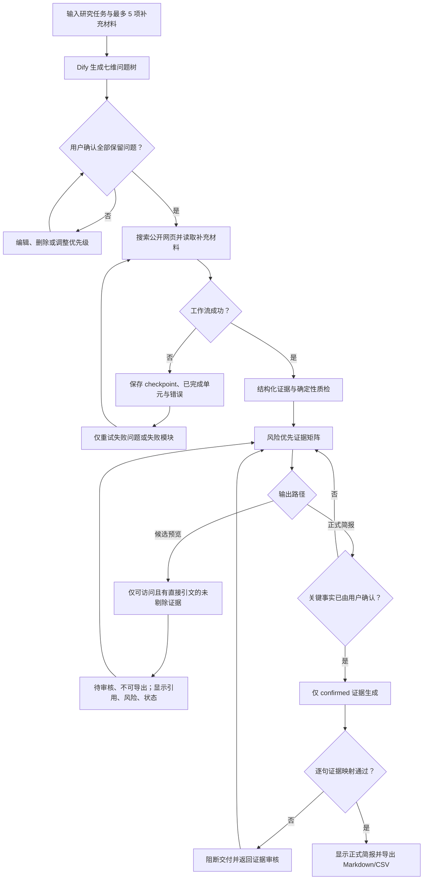
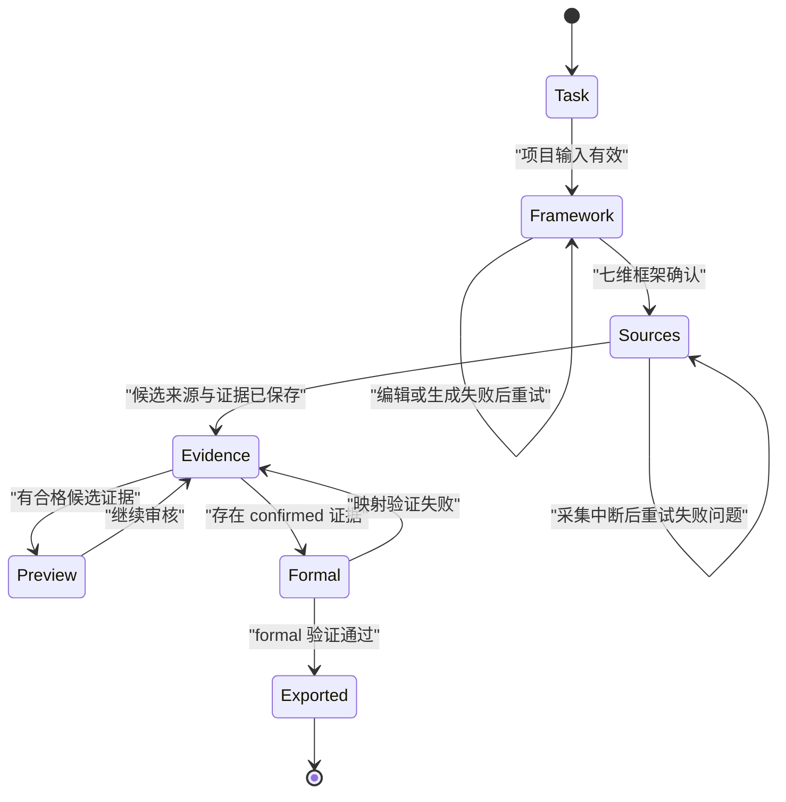
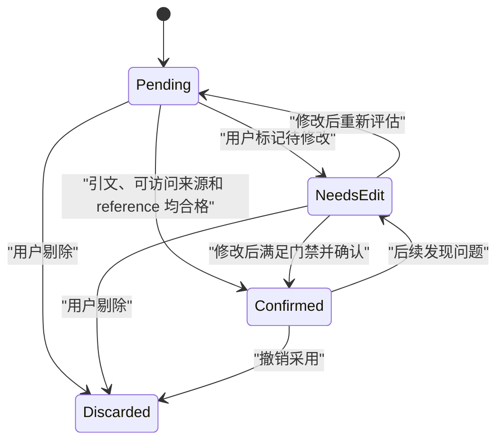
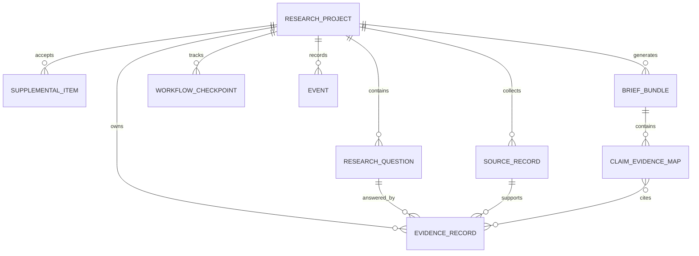
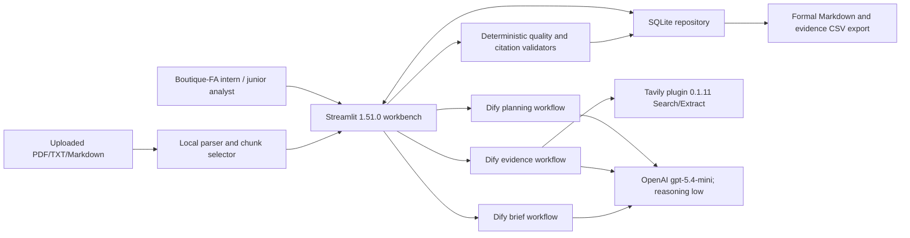

# 具身智能行业研究工作台：2–3 周 B-lite MVP 产品开发文档

## 1. 文档控制

**决策：本文是 Task 0 验证通过后，MVP 实施与作品集叙事共用的单一事实源；它定义目标状态，不代表产品已经完成。**

| 项目 | 内容 |
|---|---|
| 文档日期 | 2026-08-11 |
| 版本 | v1.0 |
| 状态 | 已批准进入实施；Task 0 已完成，Task 1–12 尚待执行 |
| 产品负责人 | 人类产品 owner：范围、口径、供应商账户/密钥、实时费用与发布批准 |
| 实施负责人 | 后续 implementers：按本文和实施计划交付、测试并留存证据 |
| 首发周期 | 15 天计划，2–3 周，接近全职投入 |
| 产品类型 | 求职作品集为主、真实用户验证为辅的 B-lite MVP |

### 权威来源与冲突规则

| 优先用途 | 来源 | 本文采用方式 |
|---|---|---|
| 已签署产品边界 | `outputs/2026-08-10-embodied-intelligence-research-workbench-design.md` | 产品目标、范围、流程、证据护栏 |
| Task 0 人访证据 | `docs/discovery-interviews.md` | `n=2` 基线、痛点、go/no-go 决策 |
| 实施合同 | `docs/superpowers/plans/2026-08-10-embodied-intelligence-research-workbench.md` | 技术栈、数据合同、Tasks 0–12、测试和发布门禁 |
| 仓库入口摘要 | `README.md` | 产品定位和原则；其中“实施计划待编写”已被更新的实施计划取代 |

冲突时采用最新的人类授权规则：候选预览只可使用来源可访问、具有直接原文摘录、未被剔除的候选证据，并显著显示引用、风险和待确认状态；预览不可导出。正式/可导出简报只可使用用户已确认的证据。

### 变更记录

| 版本 | 日期 | 变更 |
|---|---|---|
| v1.0 | 2026-08-11 | 在 Task 0 go 决策后，综合四份权威来源形成完整产品开发基线 |

### 证据类型标记

| 标记 | 含义 |
|---|---|
| **已确认决策** | 已由设计规格或最新实施计划确定 |
| **访谈证据** | 来自匿名 discovery session；必须保留样本与限制 |
| **实施选择** | 为实现已确认决策而采用的可验证技术方案 |
| **目标指标** | 尚需评测或用户测试验证，不得表述为已达成 |
| **未来假设** | MVP 后需要实验确认，不属于当前结果 |

## 2. 执行摘要与一句话定义

**决策：构建一个证据优先、人工把关的具身智能行业研究工作台，而不是自动写报告或替代投资判断的工具。**

**一句话产品定义：** 面向精品 FA 实习生和初级分析师，将公开网络搜索与每个任务最多 5 项用户补充材料转化为可追溯、可审核的证据矩阵，并仅基于用户已确认证据生成正式、可导出的中文行业研究简报。

首发聚焦中国具身智能商业化、融资与产业链，全球技术趋势和标杆公司仅作对照。用户先确认七维研究框架，再审核来源、口径、冲突与关键事实。系统允许生成“待审核、不可导出”的候选预览以降低逐条审核前的认知负担，但正式简报继续坚持确认门禁。

Task 0 已满足 go/no-go 门槛：两名合格受访者均报告了实质性重复或对齐工作，并接受澄清后的预览/正式分流。该结论只支持继续构建，不证明质量、效率或用户价值目标已经实现。

## 3. 问题证据：当前 FA 工作流、痛点与限制

**结论：现有流程的主要风险不是“没有长文本”，而是搜索、整理、定义对齐和引用核验缺少可审核的中间证据层。**

### 当前工作流

综合产品设计与访谈，典型研究任务经历：范围界定 → 问题拆解 → 搜索 → 摘录/整理 → 口径与冲突对齐 → 引用清理 → 写作 → 人工复核。可自动化的主要是重复搜索、摘录、字段整理和格式转换；市场定义、来源可信度、冲突解释和商业含义仍由人判断。

### 访谈综合

| 证据 | 已知事实 | 不得外推 |
|---|---|---|
| 样本 | `n=2`：`DV-01` 为 FA intern，`DV-02` 为 boutique-FA junior analyst | 不能代表整个精品 FA 市场 |
| 任务总时长 | 两人均报告约一周完成各自最近的行业研究任务 | 不是观测值，也不是本产品用时 |
| 分步骤基线 | scoping、search、extraction、reconciliation、citation cleanup、writing 均未获得可靠分配 | 不得补填步骤时长或计算步骤中位数 |
| 高频问题 | 定义冲突/重新对齐与数据失真均为 `2/2`；重复搜索、数据整理、来源不可访问各由 `DV-01` 报告且评分 5/5 | `DV-02` 未提供数值严重度，完整的 frequency × severity 排名不可计算 |
| 工作流接受度 | 两人均接受澄清后的预览/正式门禁 | `DV-01` 最初误解为每条证据都必须先打开来源，说明交互文案仍有风险 |

### 痛点及产品响应

| 痛点 | 访谈边界 | MVP 响应 |
|---|---|---|
| 数据定义冲突与重新对齐 | `2/2`；完整严重度分数不足 | 保留 `definition_scope`，不同口径并列，不平均、不强行合并 |
| 数据失真或不可信 | `2/2`，无完整数值严重度 | 直接引文、可访问性、人工确认、逐句证据映射 |
| 重复搜索与市场数据收集 | `1/2`，5/5 | 固定框架、Tavily 搜索/提取、URL 去重 |
| 数据整理 | `1/2`，5/5 | 结构化 `EvidenceRecord` 与证据矩阵 |
| 来源不可访问 | `1/2`，5/5 | `inaccessible_source`，禁止确认、预览和正式简报使用 |
| 界面繁琐或流程更慢 | 两人的 stop-use condition | 风险优先审核、干净记录显式批量确认、预览/正式分流 |

### 证据限制

- discovery 仅为 `n=2`，且都只报告总任务约一周；分步骤基线未知。
- `DV-01` 直接支持具身智能试点；`DV-02` 未提供行业领域，因此首发领域只有 `n=1` 直接访谈支持，同时由已确认产品策略限定。
- Task 0 只证明“值得继续”；30 题质量结果、三个端到端场景、任务时间改善和工作可用性仍是未来验证工作。

## 4. 目标用户、JTBD、用户故事与主场景

**决策：唯一首要 persona 是精品 FA 实习生/初级分析师；不引入投资人、创始人、管理员或其他角色。**

### Persona 与 JTBD

- **Persona：** boutique-FA intern / junior analyst，近期需要在有限时间内完成陌生或快速变化行业的研究底稿。
- **JTBD：** 当我需要快速研究具身智能行业时，我希望系统帮助我建立研究框架、搜集和整理可靠证据、暴露口径冲突，并基于我确认的事实生成简报，从而减少机械整理时间，同时保留我对范围、事实和结论的控制。

### 用户故事

1. 作为初级分析师，我希望先编辑并确认问题树，以免系统在错误范围内消耗时间和费用。
2. 作为初级分析师，我希望每条结论都能回到原文、来源日期、地域、时期、单位和定义口径，以便复核。
3. 作为初级分析师，我希望优先看到不可访问、冲突、过旧和字段缺失记录，以便把人工时间用于高风险判断。
4. 作为初级分析师，我希望先看显著标注且不可导出的候选预览，再继续从引用回查并确认关键事实。
5. 作为初级分析师，我希望正式简报只包含我确认的事实，并能复制 Markdown、导出证据 CSV。
6. 作为初级分析师，我希望外部流程中断后从失败模块继续，而不是丢失已完成证据。

### 三个标准端到端场景

| 场景 | 研究重点 | 必须覆盖的风险 |
|---|---|---|
| S1 | 中国市场规模/CAGR | 不同定义冲突、地域/时期/单位/口径完整性 |
| S2 | 全球技术趋势 | 技术原理来源不自动按时间淘汰 |
| S3 | 中国商业化/融资 | 公司来源超过 12 个月的 `possibly_stale` 提示 |

Task 10 的同一基线任务为：“为一次内部项目讨论，形成中国具身智能商业化进展的证据底稿，并对照全球技术趋势。”

## 5. 目标、非目标、周期约束与范围边界

**决策：15 天内优先保住证据追溯、人工审核、质量规则和评测，视觉精修最先让步。**

### MVP 目标

1. 将一次性聊天改造成 task → framework → sources → evidence → brief 的可追溯流程。
2. 让每条事实回到直接引文、来源、日期和统计口径。
3. 自动暴露时效、定义、数值、字段和访问风险，不替用户选答案。
4. 通过 30 题离线评测、三个端到端场景和 3–5 名目标用户测试建立真实证据。
5. 形成可展示的问题发现、产品设计、AI 护栏、评测、运营与迭代材料。

### 明确非目标

- 账号、支付、权限、多人协作。
- 项目 sourcing、公司推荐、对外联系。
- 多行业通用模板、长期监控、大规模私有知识库。
- Word/PPT 精美排版；首版不生成 PPT。
- 自动投资判断、无人审核结论或可直接用于投资决策的承诺。

### 约束与取舍顺序

- 周期为 2–3 周，15 天计划；供应商账户、密钥、实时费用和发布批准由人负责。
- 如延期：保留 Tasks 1–9；先削减视觉精修，再考虑延后用户测试完成时间；不得削减证据追溯、质量护栏或评测。
- 至少 3 个完整用户 session 前，不得宣称用户价值已验证。

## 6. 具身智能领域边界与七个研究维度

**决策：首发只研究具身智能，并严格区分具身智能、人形机器人与工业机器人。**

- 中国主视角：商业化进展、融资活动、产业链和主要参与者。
- 全球对照：技术趋势、关键研究方向和标杆公司。
- 市场规模或增长率必须标注 geography；中国与全球数据不得放入同一未区分序列。
- 来源定义不同，保留各自 `definition_scope` 并提示冲突，不自动归并。

七个且仅七个框架维度为：

1. 市场定义与边界；
2. 市场规模与 CAGR；
3. 产业链与关键环节；
4. 竞争格局与标杆公司；
5. 技术趋势与能力演进；
6. 融资活动与商业化进展；
7. 风险、争议与关键假设。

## 7. 产品原则与已确认决策

**决策：先证据、后写作；AI 负责整理和暴露风险，人负责范围、事实与商业判断。**

1. 每条关键结论都可回溯到原始证据、来源日期和统计口径。
2. 没有直接原文支持时返回“证据不足”，不得补写事实。
3. 数值或定义冲突并列显示，不平均、不擅自选边。
4. 来源不可访问或缺少直接引文的记录不得确认，也不得进入任何简报模式。
5. 候选预览可减少审核负担，但必须待审核、不可导出、逐句显示引用/风险/状态。
6. 正式输出只读取 `confirmed` 证据，句子无法映射时阻断或删除。
7. 人工编辑、确认、待修改和剔除均留痕；允许人工兜底但不得伪装成全自动。
8. 产品面向作品集和真实验证，不以当前创业付费验证为目标。

## 8. 端到端工作流

**决策：框架确认与正式导出是两个不可绕过的人类检查点；所有外部失败均保留已完成结果并提供有界重试。**



## 9. 信息架构与五个页面

**决策：单项目、五阶段、左侧固定导航；每页都显示当前状态、可执行动作和阻塞原因。**

| 页面 | 核心内容 | 进入/动作门禁 | 主要状态 |
|---|---|---|---|
| 01 研究需求 | `topic`、`geography`、`time_range`、`purpose`、`focus_questions`、文件/URL | 补充项验证通过后创建项目 | 未创建、有效、验证失败 |
| 02 研究框架 | 七维问题树、优先级、保留/删除、批准状态 | 每个维度至少一题且所有保留题 `approved=true` 才可启动采集 | 生成中、失败可重试、待确认、已确认 |
| 03 资料来源 | 标题、机构、角色、日期、URL、访问/提取状态 | 仅已确认框架可采集；可剔除来源 | 可访问、不可访问、解析失败、成功/中断 |
| 04 证据矩阵 | claim、数值、时期、来源、引文、口径、风险、审核状态 | 缺引文或来源不可访问不得确认 | blocked、conflict、stale、incomplete、pending、confirmed、discarded |
| 05 研究简报 | 候选预览或正式简报、逐句映射、导出 | 预览无导出；正式结果必须模式合规且验证通过 | preview、formal、validation blocked、retryable failure |

## 10. 功能需求

**决策：以下 40 项 `FR` 是 MVP 可验收的功能基线；每项均映射到 owning task。**

| ID | 优先级 | 需求 | 可验证验收标准 | Owning task |
|---|---|---|---|---|
| FR-001 | P0 | 创建研究项目 | 表单持久化 `topic`、`geography`、`time_range`、`purpose`、`focus_questions`，默认主题为“具身智能”、地域为“中国为主，全球对照” | Task 3 |
| FR-002 | P0 | 五阶段导航 | 应用仅展示研究需求、研究框架、资料来源、证据矩阵、研究简报五页，且项目 ID 在页面切换后保持 | Task 1 |
| FR-003 | P0 | 项目阶段持久化 | 重启 repository 后可恢复项目、框架、来源、证据、简报和最新 checkpoint | Task 2 |
| FR-004 | P0 | 补充项总量限制 | 文件与 URL 合计恰好 5 项通过，6 项返回 `too_many_items` | Task 3 |
| FR-005 | P0 | 文件类型与大小限制 | 仅 `.pdf`、`.txt`、`.md`；20 MiB 通过，20 MiB + 1 byte 失败；URL 计入 5 项 | Task 3 |
| FR-006 | P1 | 补充材料提取与选段 | PDF 按页标记 `[filename p.N]`；扫描 PDF 无文本返回 `parse_failed`；上下文不超过 80,000 字符并报告省略 chunk 数 | Task 3 |
| FR-007 | P0 | 生成固定七维框架 | 输出七个且仅七个维度，每维 3–6 题，总计 21–42 个唯一 ID，priority 为 1–3，初始 `approved=false` | Task 5 |
| FR-008 | P0 | 人工编辑框架 | 用户可改问题与 priority、删除行，但不能引入任意维度；重跑页面后删除结果仍存在 | Task 5 |
| FR-009 | P0 | 框架确认门禁 | 每维至少保留一题且所有保留题批准前，证据采集动作禁用；确认后记录时间与事件 | Task 5 |
| FR-010 | P0 | 公开搜索计划 | 每个批准问题生成 2 个中文和 1 个英文查询，每查询最多 5 个结果，按 canonical URL 去重后 Extract | Task 6 |
| FR-011 | P0 | 用户 URL 与文件并入采集 | 用户 URL 即使不在搜索结果也送入 Extract；文件选段带页码标签进入提取；单项失败不阻断其他来源 | Task 6 |
| FR-012 | P0 | 来源清单与剔除 | 显示完整来源元数据，可筛选 inaccessible/lead-only；剔除来源同步将关联证据设为 `discarded` | Task 6 |
| FR-013 | P0 | 结构化证据提取 | 每条记录只表达一个事实/观点并包含直接 `evidence_quote`、问题、来源、地域、时期、单位、口径及风险字段 | Task 6 |
| FR-014 | P0 | 证据不足处理 | 无直接证据返回带 `missing_evidence` 的候选记录；不可访问来源带 `inaccessible_source`；均不得补写答案 | Task 6 |
| FR-015 | P1 | 采集幂等 | 相同 workflow run ID 重复完成后只保留一个逻辑副本，稳定 ID 合并不重复 | Task 6 |
| FR-016 | P0 | 自动质量评估 | 对缺引文、不可访问、关键字段缺失、lead-only、来源偏差、标题正文不符和解析失败应用确定性标签 | Task 7 |
| FR-017 | P0 | 数值/定义冲突检测 | 同问题+地域+时期+单位+口径的不同数值标 `value_conflict`；去掉口径后的组含多个非空口径标 `definition_conflict`，记录保持分离 | Task 7 |
| FR-018 | P0 | 时效规则 | company/commercialization/financing/competition 超过 12 个月、market/supply_chain 超过 24 个月标 `possibly_stale`；technical_principle/history/standard 自动豁免 | Task 7 |
| FR-019 | P0 | 风险优先证据矩阵 | 默认依次排序 blocked、conflicts、stale、incomplete、clean pending、confirmed、discarded；详情显示引文、URL、日期、口径及每个标签原因 | Task 7 |
| FR-020 | P0 | 证据审核动作 | 用户可设为 `confirmed`、`needs_edit` 或 `discarded`，并可显式批量确认满足门禁的干净记录 | Task 7 |
| FR-021 | P0 | 确认阻断 | 缺直接引文、来源不可访问或无 URL/local reference 的记录尝试确认后仍为 `pending` 并显示原因 | Task 1 / Task 7 |
| FR-022 | P1 | 人工变更留痕 | 每次 edit/confirm/needs-edit/discard 记录 evidence ID、前后状态、变更字段和 UTC 时间 | Task 7 / Task 10 |
| FR-023 | P0 | 候选预览资格 | 预览只接收可访问、有非空直接引文、未被剔除的记录；没有合格记录时不提供生成动作 | Task 8 |
| FR-024 | P0 | 预览显著隔离 | 首行显示“待审核、不可导出预览”；每个事实句显示证据 ID、风险和 pending/unconfirmed 状态；界面无复制为正式、下载或导出控件 | Task 8 |
| FR-025 | P0 | 正式简报资格 | 正式模式唯一输入为 `review_status=confirmed` 的证据；没有确认证据时正式生成不可用 | Task 8 |
| FR-026 | P0 | 逐句证据映射 | 每个事实句映射至少一个允许的稳定 evidence ID；仅标题和明确“现有可用证据不足”句可为空数组 | Task 8 |
| FR-027 | P0 | 简报本地验证 | 未知 ID、模式不合格证据或未映射事实句使结果 blocked；显示阻断句并返回证据审核，不显示下载控件 | Task 8 |
| FR-028 | P0 | 正式导出 | 仅通过验证的 `formal` 可导出 `研究简报.md` 和 UTF-8 BOM `证据矩阵.csv`；Markdown 带编号来源附录及稳定 ID | Task 8 |
| FR-029 | P0 | 事务性持久化 | `replace_evidence()` 在单事务内完成；注入重复 ID 失败时旧记录不变；SQLite 开启 WAL 和 foreign keys | Task 2 |
| FR-030 | P0 | 中断与恢复 | plan/evidence/brief 均写 running/succeeded/failed checkpoint；失败保留上次成功结果和 completed IDs，并提供从失败模块继续的动作 | Tasks 2, 5, 6, 8 |
| FR-031 | P0 | 30 题评测集 | 恰好 30 题，五类各 6 题；每题包含 required fields、severe rules 和人工 gold source/claim 数据 | Task 9 |
| FR-032 | P0 | 离线与实时评测模式 | fixture 模式不发网络请求；live 模式必须显式 `--confirm-live-cost` 且有 secrets | Task 9 |
| FR-033 | P0 | 指标与门槛判定 | 输出逐题失败、聚合率、严重错误数和 PASS/FAIL；分母为 0 返回 `None` 并以 `insufficient_sample` 失败 | Task 9 |
| FR-034 | P1 | 本地 telemetry | 记录十个指定事件、UTC 时间，并由事件计算阶段耗时，不使用 Streamlit session uptime | Task 10 |
| FR-035 | P0 | telemetry 隐私阻断 | payload 含 `api_key`、`token`、`secret`、`document_text` 或 `evidence_quote` 即拒绝；用户标识只接受 `UT-__` session code 而非 email | Task 10 |
| FR-036 | P1 | 45 分钟可用性测试包 | 协议按 0–5/5–10/10–30/30–35/35–40/40–45 分钟执行并导出匿名行为字段 | Task 10 |
| FR-037 | P0 | 无供应商 CI | push/PR 到 `main` 时在 Python 3.12、15 分钟超时、无 provider secrets 环境运行 lint、pytest coverage、workflow validation 和 fixture eval | Task 11 |
| FR-038 | P0 | 三个完整 AppTest 场景 | S1–S3 均创建项目、批准七维框架、载入证据、阻断一条无效确认、确认一条有效记录、生成映射简报并出现两个正式下载按钮；断言无网络 | Task 11 |
| FR-039 | P1 | 显式 live smoke | 仅在用户批准费用后，以显式 workflow selector 跑一条小请求；schema/guardrail 失败返回非零，日志不泄露密钥 | Task 11 |
| FR-040 | P0 | 真实用户结果与案例 | 至少 3 个完整 session 后，仓库只保存匿名汇总；案例仅写实测聚合值、失败类别、未达标项和下一实验 | Task 12 |

## 11. 非功能需求

**决策：安全、隐私和证据可靠性优先于速度与视觉精修。**

| ID | 类别 | 优先级 | 需求与验收标准 | Owning task |
|---|---|---|---|---|
| NFR-001 | Security | P0 | Dify 三个 workflow 各用独立 server-side key；本地仅放 `.streamlit/secrets.toml`，部署仅放 Streamlit Secrets；Git 搜索与历史检查无密钥 | Tasks 1, 11 |
| NFR-002 | Security | P0 | HTTP 错误字符串不含 API key；Authorization header 被编辑，provider response 在错误中截断；相应单元测试/live smoke 通过 | Tasks 4, 11 |
| NFR-003 | Security | P0 | 用户测试部署保持 private，仅邀请 3–5 名测试者；发布清单由人确认 | Task 11 |
| NFR-004 | Privacy | P0 | 仅使用 `DV-__`/`UT-__`；不记录姓名、雇主、客户、交易、邮箱、联系方式或机密材料；人工 staging 前检查通过 | Tasks 0, 10, 12 |
| NFR-005 | Privacy | P0 | event payload 不保存完整上传文档、直接引文或 secrets；隐私拒绝测试通过 | Task 10 |
| NFR-006 | Privacy | P1 | 用户测试结果只提交规定的匿名汇总列，raw provider payload 与本地 eval run 不入 Git | Tasks 9, 12 |
| NFR-007 | Reliability | P0 | 数据替换使用显式 SQLite transaction、WAL、foreign keys；rollback 测试证明失败不破坏旧结果 | Task 2 |
| NFR-008 | Reliability | P0 | workflow completion 以 run ID 幂等；重复回调不生成逻辑重复记录 | Task 6 |
| NFR-009 | Reliability | P0 | 429/500/502/503/504 与 transport error 最多两次总尝试；失败保留上次验证结果并显示可重试动作 | Tasks 4, 5, 6, 8 |
| NFR-010 | Performance/Cost | P1 | Dify blocking call timeout 为 60 秒，重试延迟 0.5 秒后 1 秒且总尝试不超过 2 | Task 4 |
| NFR-011 | Performance/Cost | P1 | 证据 workflow 批量问题 parallelism=3；每问题最多 15 个原始搜索结果并在提取前 URL 去重 | Task 6 |
| NFR-012 | Performance/Cost | P0 | 补充上下文上限 80,000 chars；实时调用前显示供应商和费用影响并取得用户批准 | Tasks 3, 9, 11 |
| NFR-013 | Accessibility/UX | P1 | 主界面为中文，技术 ID 保持稳定；五页均有标题和当前任务说明，AppTest 可按明确 key 找到核心动作 | Tasks 1, 5–8 |
| NFR-014 | Accessibility/UX | P0 | 风险、审核状态和模式均以可见文字呈现而非仅靠颜色；页面截图/人工检查可辨认 blocked、pending、confirmed 与 preview/formal | Tasks 7, 8 |
| NFR-015 | Accessibility/UX | P0 | empty、error、interrupted 均说明发生了什么、保留了什么和下一动作；AppTest 覆盖无结果、失败重试和验证阻断 | Tasks 5, 6, 8, 11 |
| NFR-016 | Observability | P0 | 每个 workflow 保存 status、run ID、completed unit IDs、sanitized error 与 UTC updated_at；页面显示最新 checkpoint | Tasks 2, 5, 6, 8 |
| NFR-017 | Observability | P1 | 人工审核和十个产品事件可按 project/session 导出并计算阶段耗时；无敏感 payload | Tasks 7, 10 |
| NFR-018 | Observability | P0 | CI 和 eval 输出精确测试计数、指标、严重错误和阈值状态；fixture 结果不得被描述为 live quality | Tasks 9, 11 |

## 12. 产品状态模型与审核状态转换

**决策：项目阶段顺序推进但失败可恢复；证据确认有硬门禁，不能通过 UI 或 repository 绕过。**





`ReviewStatus` 精确枚举：`pending`、`confirmed`、`needs_edit`、`discarded`。`WorkflowStatus` 精确枚举：`running`、`succeeded`、`failed`。确认门禁要求：非空直接引文、来源可访问、至少一个 `source_url` 或 `source_reference`，且不含 `missing_evidence`/`inaccessible_source`。

## 13. 最小数据模型、关键枚举与关系

**决策：以稳定 ID、不可变 Pydantic contract 和 SQLite JSON 持久化为核心，简报事实句通过显式映射关联证据。**

| 实体 | 最小关键字段 | 关系/约束 |
|---|---|---|
| `ResearchProject` | id, topic, geography, time_range, purpose, focus_questions, supplemental_items, stage, workflow run IDs, timestamps | 拥有 framework、sources、evidence、briefs、checkpoints、events |
| `SupplementalItem` | id, kind=`file|url`, display_name, reference, byte_size, extraction_status, warning | 每项目最多 5 项 |
| `ResearchQuestion` | id, dimension, question, priority, approved | 属于 project；七维每维至少一题才能确认 |
| `SourceRecord` | id, project_id, title, organization, source_type, url/local_reference, publication_date, accessed_at, access_status, extraction_status, risk_flags, workflow_run_id | 至少存在 url 或 local_reference；一对多 evidence |
| `EvidenceRecord` | id, project/question/source IDs, research_question, category, claim, numeric_value, unit, geography, period, definition_scope, source fields, evidence_quote, risk_flags, review_status | 属于一个 source 和 question；confirm 有硬门禁 |
| `WorkflowCheckpoint` | project_id, workflow, run_id, status, completed_unit_ids, sanitized error, updated_at | 每个 workflow 保留最新恢复点 |
| `BriefBundle` | project_id, mode, markdown, claim_evidence_map, created_at | `preview|formal`；多条 mapping 指向 evidence |
| `ClaimEvidenceMap` | sentence, evidence_ids | 每个事实句至少一个允许 ID；标题/明确证据缺口例外 |
| `Event` | project/session, event_name, safe payload, UTC timestamp | 不含 secret、document_text 或 evidence_quote |

关键枚举：

- `ProjectStage`: `task`, `framework`, `sources`, `evidence`, `brief`
- `SourceType`: `primary`, `research`, `secondary`, `lead_only`
- `AccessStatus`: `accessible`, `inaccessible`, `local`
- `ExtractionStatus`: `pending`, `extracted`, `failed`
- `EvidenceCategory`: `company`, `commercialization`, `financing`, `competition`, `market`, `supply_chain`, `technical_principle`, `history`, `standard`
- `RiskFlag`: `missing_evidence`, `inaccessible_source`, `missing_key_field`, `definition_conflict`, `value_conflict`, `possibly_stale`, `lead_only_source`, `source_bias`, `title_content_mismatch`, `parse_failed`
- `BriefMode`: `preview`, `formal`



## 14. AI 与数据架构

**决策：Dify 编排三条 AI workflow；Streamlit 负责交互、人工门禁、确定性规则、持久化、验证、导出与评测。**



边界：Dify 不拥有最终事实批准；Tavily 结果仍需检查可访问性和证据支持；OpenAI 不可引入事实库外内容；uploaded files 先在本地解析和限量选段，再发送必要摘录；SQLite 是 MVP 单机事实存储。

## 15. 三条 AI 工作流

**决策：三条 workflow 通过严格 JSON schema 传递结构化结果，并在模型前后设置确定性检查与人工检查点。**

| Workflow | 输入 | 输出 | 模型行为 | 确定性检查 | 人类检查点 |
|---|---|---|---|---|---|
| Planning | `topic`, `geography`, `time_range`, `purpose`, `focus_questions` | `framework_json` | 中文拆解问题；七维每维 3–6 题；不搜索、不回答、不估数字 | schema：21–42 唯一 IDs、固定 dimension、priority 1–3、无额外字段 | 用户编辑/删除并批准所有保留题；每维至少一题 |
| Evidence collection | `project_id`, `framework_json`, `supplemental_context` | `sources_json`, `evidence_json` | 每批准问题生成 2 中/1 英查询；从正文逐字引文；缺失字段不猜测 | URL dedupe、source/reference 至少一项、schema、质量/冲突/时效规则、run 幂等 | 来源可剔除；风险优先审核；关键数据确认 |
| Brief | `project_id`, `brief_mode`, `evidence_json` | `brief_json` | 只用给定事实库；逐句写 `[EV:id]`；冲突并列；无证据章节写缺口 | mode 资格、未知 ID、逐句 mapping、blocked sentence、导出资格 | 预览继续回查；正式模式前确认事实；导出前验证通过 |

所有 workflow 使用 `gpt-5.4-mini`、low reasoning、structured output。Planning 不执行搜索；Evidence extractor 不写报告；Brief editor 不做新事实发现。三个 key 分开保存为 `DIFY_PLAN_API_KEY`、`DIFY_EVIDENCE_API_KEY`、`DIFY_BRIEF_API_KEY`。

## 16. 证据质量、来源分类、时效、冲突、引用与导出护栏

**决策：直接支持与可访问性是所有输出模式的底线，用户确认是正式导出的额外条件。**

### 来源分类

| 类型 | 例子与用途 | 处理 |
|---|---|---|
| `primary` | 政府、监管、标准、论文、公司公告/官网 | 支持政策、技术、公司事实；公司材料追加 `source_bias` |
| `research` | 披露方法的协会、咨询、研究机构 | 可支持市场规模、预测与结构，仍保留定义 |
| `secondary` | 有编辑审核的主流媒体 | 适合事件和观点；关键数字尽量交叉验证 |
| `lead_only` | 聚合站、无引用营销页、来源不明内容 | 仅发现线索，标 `lead_only_source`，不可单独支撑正式结论 |

### 规则

- 数字结论必须有 geography、period、unit、definition_scope；缺任一项标 `missing_key_field`。
- 公司/商业化/融资/竞争来源年龄 `>12 months` 标 `possibly_stale`；市场/产业链 `>24 months` 标记；历史、标准、技术原理豁免自动时效淘汰，但仍显示发布日期。
- “可能过旧”是提示而非自动剔除；用户说明理由后可确认。
- 同问题同口径不同值并列；不同 `definition_scope` 永不求平均或强制合并。
- 来源不可访问：可保留候选记录用于显示缺口，但禁止进入 preview/formal。
- preview：accessible + direct quote + not discarded；事实句显示 citation、risk、pending/unconfirmed；无任何 export/download。
- formal：仅 `confirmed`；所有事实句必须映射允许 evidence ID；验证失败即阻断。

## 17. 补充文件/URL 摄取限制与处理

**决策：每项目最多 5 项补充材料，限制在可控的文本类型和上下文预算内。**

- 文件与 URL 合计最多 5 项；公开搜索来源不计入此额度。
- 文件仅 PDF/TXT/Markdown；每文件上限 20 MiB（`20 * 1024 * 1024` bytes）。
- 常量：`CHUNK_CHARS=6_000`、`CHUNK_OVERLAP=300`、`MAX_CONTEXT_CHARS=80_000`。
- PDF 逐页提取并带 `[filename p.N]`；扫描件无文本标 `parse_failed`，不抛出阻断整个项目的异常。
- 文本按段落切块，依据问题词与 chunk 词重合排序；取最高相关 chunk 至上下文上限，并显示省略数量。
- 用户 URL 通过 Tavily Extract；不可访问时标记失败，不阻断其余来源。
- 文件全文不进入 telemetry，只有必要选段进入 Dify evidence workflow。

## 18. 错误、空状态、中断、重试与恢复

**决策：所有异常都必须可见、有下一动作，并避免丢失上次成功结果。**

| 状态 | 系统行为 | 用户下一动作 |
|---|---|---|
| 表单/补充项无效 | 留在研究需求页，显示具体 item 与限制 | 删除或替换无效项 |
| 搜索无结果 | 显示证据缺口，不生成猜测性结论 | 修改框架、补充材料或保留缺口 |
| 来源不可访问 | 保存候选元数据，禁止确认/预览/formal | 替换或补充来源 |
| 标题与正文不匹配 | 标 `title_content_mismatch` 并优先审核 | 剔除或人工核实 |
| 数字/定义冲突 | 并列原值、来源、地域、时期、单位、口径 | 人工判断采用或保留冲突 |
| 关键字段缺失 | 自动重试一次；仍失败进入待处理 | 编辑、补充或剔除 |
| 文件解析失败 | 标记失败文件，其他材料继续 | 替换为可解析文件 |
| Dify/API 中断 | 写 failed checkpoint、sanitized error、completed IDs；保留旧结果 | 从失败 module/question 重试 |
| 简报含证据外事实 | 判为严重错误并阻断该版本 | 返回 evidence review 或重新生成 |
| 无 preview 合格证据 | 显示原因且不显示生成按钮 | 解决访问/引文问题 |
| 无 confirmed 证据 | 不提供 formal 生成 | 完成至少一条合格确认 |
| formal 验证失败 | 显示 blocked sentences，隐藏下载 | 返回证据审核 |

## 19. 评测计划

**决策：用固定 30 题、三个无网络端到端场景和后续真实用户测试分别验证事实质量、流程可靠性与用户结果。**

### 数据集与场景

- 30 题：市场定义、市场规模/CAGR、技术趋势、产业链/竞争、融资/商业化，各 6 题。
- 每题含人工参考 claims、可接受 source URLs、publication date、geography、period、unit、definition_scope 和严重错误规则。
- 三个 E2E 场景采用 S1–S3，fake Dify + temporary SQLite，并断言无网络。

### 精确指标、公式与目标

| 指标 | 公式/计数 | 目标 |
|---|---|---:|
| Evidence support rate | `supported_claims / total_claims` | ≥85% |
| Accessible citation rate | `accessible_citations / total_citations` | ≥90% |
| Key-field completeness | `complete_numeric_claims / total_numeric_claims` | ≥85% |
| Severe factual errors | 30 题中“可能误导行业判断”的错误数；证据外事实属于严重错误 | ≤1/30 |
| Task-time improvement | 同一参与者 `(participant-reported baseline total - observed product total) / participant-reported baseline total` | ≥30% |
| Work-usable/reuse users | 完整 session 中明确认为可用于工作且回答会再次使用的人数 | 至少 3 人 |

分母为 0 时，相应比例返回 `None`，不能返回 0 或 1，并以 `insufficient_sample` 判定未通过。Task-time 只比较同一参与者、同一基线任务；基线标记 participant-reported，产品时间标记 observed。小样本报告原始人数和任务，不包装为精确留存或市场结论。

## 20. 用户研究、可用性测试、事件计划与隐私排除

**决策：Task 10–12 通过匿名 session code 记录行为，不收集身份或机密业务内容。**

### 45 分钟协议

| 时间 | 内容 |
|---|---|
| 0–5 min | consent、角色、最近研究任务 |
| 5–10 min | 重构现有流程和 baseline time |
| 10–30 min | 无辅导完成标准任务 |
| 30–35 min | 检查并修正至少三条证据 |
| 35–40 min | 生成/导出简报 |
| 40–45 min | trust、usefulness、blocker、repeat-use 问题 |

### 事件

`project_created`、`framework_generated`、`framework_confirmed`、`evidence_started`、`evidence_completed`、`evidence_reviewed`、`brief_generated`、`brief_exported`、`task_abandoned`、`manual_intervention`。

记录完成、总用时和阶段用时、人工介入、confirmed/edited/discarded 数、导出与逐字 repeat-use 回答。时间由 UTC events 推导，不由 session uptime 推导。

隐私排除：姓名、雇主、客户、交易、项目代号、邮件、联系方式、机密文档、API key/token/secret、完整 `document_text` 和 `evidence_quote`。仓库只保留匿名汇总；上传客户材料不得进入测试数据或 Git。

## 21. 技术栈与仓库架构

**实施选择：当前技术栈固定为 Python 3.12、Streamlit 1.51.0、Dify Cloud、Tavily plugin 0.1.11、OpenAI `gpt-5.4-mini` low reasoning、SQLite、Pydantic、HTTPX、pandas、pypdf、pytest、AppTest、Ruff、GitHub Actions、Streamlit Community Cloud。**

```text
streamlit_app.py                 # 五页入口
app/state.py                     # session/project helpers
app/pages/{task_setup,framework,sources,evidence,brief}.py
src/{config,domain,storage,ingestion,dify_client,quality}.py
src/{brief_validation,exporting,telemetry}.py
prompts/{research_plan,evidence_extraction,brief_generation}.md
schemas/{research_framework,evidence_bundle,brief_bundle}.schema.json
workflows/{research_plan,evidence_collection,brief_generation}.yml
evals/questions.csv + evals/gold/ + evals/runs/.gitkeep
scripts/{validate_workflows,run_eval,smoke_live}.py
tests/fixtures/ + tests/test_*.py
docs/{discovery-interviews,runbook,user-test-script,portfolio-case-study}.md
.github/workflows/ci.yml
.streamlit/config.toml
requirements.txt + requirements-dev.txt
```

Streamlit 是 server layer；Dify key 不暴露给客户端。所有自动测试不调用 live Dify/Tavily/OpenAI，live smoke 单独显式执行。

## 22. 15 天路线图、依赖与人类检查点

**决策：Tasks 0–12 顺序建立证据合同、工作流、门禁、评测、运营和作品集；Task 0 已完成。**

| 日 | Task | 结果 | 关键依赖 | 人类检查点 |
|---:|---|---|---|---|
| 1 | Task 0 | `n=2` discovery、baseline、go 决策 | 近期完成行业研究的目标用户 | 访谈真实性、匿名化、go/no-go；已完成 |
| 2 | Task 1–2 | foundation、domain contracts、SQLite | Task 0 go | 范围无新增 persona/功能 |
| 3 | Task 3 | 补充材料验证/解析 | domain/storage | 上传资料不含机密测试数据 |
| 4 | Task 4 | Dify client、JSON schema、contract validator | provider contract | Dify 账户与三个 key 由人创建 |
| 5–6 | Task 5 | planning workflow 与 framework gate | Task 4 | 在 Dify 测试并导出 DSL |
| 7–8 | Task 6 | Tavily evidence workflow 与 source page | Tasks 3–5 | 安装 Tavily 0.1.11、批准使用 key/费用 |
| 9 | Task 7 | deterministic quality、review queue | Task 6 | 复核风险文案和人工修改语义 |
| 10 | Task 8 | preview/formal、citation guardrail、exports | Task 7 | 确认预览不可导出、formal 硬门禁 |
| 11 | Task 9 | 30 题 benchmark 与 eval runner | Tasks 4–8 | 人工 gold 与 severe-error rules |
| 12 | Task 10 | telemetry 与 user-test protocol | 可运行 MVP | 同意、匿名字段和测试招募 |
| 13 | Task 11 | CI、runbook、三 E2E、live smoke、部署 | Tasks 1–10 | 账户/密钥/费用、private deploy、release approval |
| 14–15 | Task 12 | 3–5 sessions、live eval、案例 | release gate | 至少 3 完整 session、人工检查匿名结果与结论真实性 |

Task 依赖主链：`0 → 1 → 2 → 3/4 → 5 → 6 → 7 → 8 → 9 → 10 → 11 → 12`。若 Day 15 未完成用户测试，可延后 Task 12，但不得提前宣称 validated user value。

## 23. 部署、密钥、CI、发布门禁与回滚/恢复

**决策：部署仅用于私有用户测试；release gate 不含 provider secrets，live smoke 需要单独人工批准。**

### 部署与 secrets

1. 人类创建 Dify Cloud workspace，配置 OpenAI `gpt-5.4-mini` 和 Tavily plugin 0.1.11。
2. 导入三份 workflow YAML，每条 workflow 创建独立 API key。
3. 本地 key 仅放 `.streamlit/secrets.toml`；部署 key 仅放 Streamlit Community Cloud Secrets；均不提交 Git。
4. 私有 GitHub repo 连接 Streamlit Community Cloud，选择 Python 3.12 和 `streamlit_app.py`；测试期间保持 private，只邀请 3–5 人。

### CI / release gate

```text
ruff check streamlit_app.py app src scripts tests
python -m pytest --cov=src --cov=app --cov-report=term-missing -q
python scripts/validate_workflows.py workflows
python scripts/run_eval.py --mode fixture --input tests/fixtures/eval_run.json
```

四条命令必须 exit 0；CI 15 分钟超时且无 provider secrets。随后在明确费用批准下运行 `python scripts/smoke_live.py --workflow all --confirm-live-cost`。只有 schema、guardrail、三个 E2E、fixture eval 和 live smoke 均通过，且无 secret 日志，才允许私有测试发布。

### 回滚与恢复

- workflow 失败不覆盖上次成功数据；checkpoint 保留 failed module 和 completed IDs。
- SQLite replacement 使用事务；失败自动回滚至旧记录。
- brief 失败保留上一版已验证结果；未通过新结果不显示下载。
- 供应商变更或 workflow regression 时，回滚到最近通过 contract validator、fixture eval 和 smoke 的版本；恢复后重新跑完整 release gate。
- 不把本地 SQLite、raw eval runs、secrets 或上传材料作为 Git 回滚资产。

## 24. 风险、权衡、假设、缓解与开放问题

**结论：最大风险是小样本、供应商可用性、证据质量与审核负担；MVP 通过明确边界和可观察门禁管理，而不是假装消除风险。**

| 类型 | 风险/权衡/假设 | 缓解或验证 |
|---|---|---|
| 证据限制 | discovery 仅 `n=2`，步骤基线未知 | Task 10 观察阶段时长；结果报告原始人数 |
| 领域假设 | 具身智能只有 `n=1` 直接访谈领域证据 | 首发仍按已确认策略限定；Task 10 检查任务适配性 |
| 可信度 | 搜索源不可访问、定义不一致、公司材料偏差 | 直接引文、source taxonomy、risk flags、人工确认 |
| 幻觉 | LLM 引入 evidence 之外事实 | structured output、逐句 mapping、local validator、严重错误 gate |
| 审核负担 | 逐条复核可能比原流程慢 | 风险优先排序、候选预览、干净记录显式批量确认；实测任务时间 |
| 成本/延迟 | Dify/Tavily/OpenAI 费用与 blocking timeout | 结果上限、URL dedupe、上下文预算、显式费用确认、fixture-first |
| 供应商依赖 | plugin/API/模型可用性或 schema 变化 | typed client、workflow contract validator、smoke、保留 checkpoints |
| 隐私 | 用户上传机密材料或 telemetry 泄露 | 私有测试、最小选段、禁止敏感 payload、人工 staging 检查 |
| 取舍 | Streamlit/SQLite 适合 B-lite 单用户验证，不支持多租户 | 明确排除账号/权限/协作；验证后再评估架构 |
| 结果表述 | 目标指标被误写为已达成 | 文档统一标为目标；Task 12 仅使用实际测量值 |

开放问题（均不阻塞当前开发）：

1. 风险优先队列与批量确认的具体交互，是否能避免 `DV-01` 的“必须逐条先开来源”误解？
2. 真实用户最信任的 source role、引用展示密度和 conflict 解释方式是什么？
3. 30 题 live 评测的失败分布是否集中在搜索、解析、抽取、口径、引用还是生成？
4. 私有 Streamlit 部署的性能与 Dify 实时成本是否符合 3–5 人测试预算？
5. 通过 MVP 验证后，是否值得支持第二行业、长期监控或更丰富导出？这些均为未来假设，不在当前范围。

## 25. Prototype、MVP 与已验证作品集案例的完成定义

**决策：三个完成层级不可混用；“界面能走通”不等于“MVP 达标”，更不等于“用户价值已验证”。**

### Prototype DoD

- 五页导航与 task/framework/source/evidence/brief 主状态可演示。
- 可用 fake provider data 完成三个标准场景。
- preview/formal 可见分流，且 preview 无导出。
- 无假结果或把目标指标写成已达成。

### MVP DoD

1. 用户可从任务输入走到证据矩阵、待审核不可导出预览和正式可导出简报。
2. preview 仅用 accessible + direct quote + not discarded，显示引用/风险/待确认；formal 仅用 confirmed。
3. 来源不可访问、数字冲突、字段缺失、流程中断四类异常均有可观察处理。
4. 30 题离线评测与三个 E2E 场景已执行并留存真实结果。
5. 完整 CI、workflow validation、fixture eval 和获批 live smoke 通过。
6. 若尚无至少 3 名用户完成测试，产品可称“技术 MVP”，但不可称“已验证用户价值”。

### Validated portfolio case study DoD

- 至少 3 名目标用户完成标准测试，匿名行为记录可复盘。
- 最新 live 30 题 aggregate metrics 和失败类别已人工核查。
- 明确报告每个目标达成或未达成、人工介入、样本限制与下一实验。
- 作品集和简历只使用经验证人数、任务、指标和改善，不使用推测性结果。

## 26. 作品集/简历证据计划

**决策：作品集展示决策质量和验证过程，不预写成功数字。**

| 叙事模块 | 需留存证据 | 可在完成后陈述 | 当前禁止陈述 |
|---|---|---|---|
| 问题发现 | `n=2` 匿名访谈、旧流程、痛点及限制 | 两人均约一周总时长并接受澄清门禁 | 步骤中位时长、市场普遍结论 |
| 产品设计 | persona、JTBD、范围、流程、预览/formal 取舍 | 已确认范围和 go 决策 | “用户都需要” |
| AI 设计 | 三 workflow、schemas、证据模型、人类 checkpoint | 可验证 guardrail 设计与测试 | “零幻觉” |
| 评测 | 30 题 gold、公式、E2E、真实 run | 实际 aggregate metrics 与失败类别 | ≥85%/≥90% 等目标已达成 |
| 运营 | 招募、45 分钟脚本、events、匿名 summary | 真实完成数、行为、exact reuse answer | 未测试的留存、付费意愿 |
| 迭代 | failure taxonomy、人工介入、修复前后同集回归 | 同一数据集上的实测变化 | 无法复现的改善 |

最终案例结构：一句话实测结果 → 用户与流程问题 → evidence-first 选择 → MVP 取舍 → AI/data architecture → 评测设计与实际结果 → 用户行为与实际结果 → 三个关键失败/迭代 → 剩余风险/下一实验 → 只含 verified numbers 的 resume bullet。

## 27. 附录

### A. 需求到任务追踪矩阵

| Task | 主要 FR | 主要 NFR | 人类拥有的产物/门禁 |
|---|---|---|---|
| 0 | — | NFR-004 | discovery 真实性、匿名化、go/no-go |
| 1 | FR-002, FR-021 | NFR-001, NFR-013 | 范围确认 |
| 2 | FR-003, FR-029, FR-030 | NFR-007, NFR-016 | 数据 contract review |
| 3 | FR-001, FR-004–006 | NFR-012 | 补充材料安全边界 |
| 4 | FR-032 的 client 基础 | NFR-002, NFR-009–010 | Dify 账户/key |
| 5 | FR-007–009, FR-030 | NFR-013, NFR-015–016 | Dify planning 测试/DSL |
| 6 | FR-010–015, FR-030 | NFR-008, NFR-011, NFR-015–016 | Tavily 安装/key/费用 |
| 7 | FR-016–022 | NFR-014, NFR-017 | 风险与审核交互复核 |
| 8 | FR-023–028, FR-030 | NFR-014–016 | preview/formal 与导出确认 |
| 9 | FR-031–033 | NFR-006, NFR-012, NFR-018 | gold 标注、live cost |
| 10 | FR-022, FR-034–036 | NFR-004–006, NFR-017 | consent、招募、隐私 |
| 11 | FR-037–039 | NFR-001–003, NFR-015–018 | private deploy、live cost、release |
| 12 | FR-040 | NFR-004, NFR-006, NFR-018 | session、匿名检查、真实结论 |

### B. 术语表

| 术语 | 定义 |
|---|---|
| B-lite MVP | 以明确单一 persona、单领域、轻量工作台和人工兜底完成真实验证的首版 |
| Evidence matrix | 以问题、claim、数值字段、口径、来源、直接引文、风险和审核状态组织的中间事实层 |
| Candidate evidence | 尚未确认但可进入审核流程的证据；只有 accessible + direct quote + not discarded 子集可用于 preview |
| Preview | `brief_mode=preview`；待审核、不可导出，每个事实句显示引用、风险和 pending/unconfirmed 状态 |
| Formal brief | `brief_mode=formal`；只用 `confirmed` 证据，经逐句映射验证后可导出 |
| Direct quote | 逐字来自来源正文、保留最小充分上下文的 `evidence_quote` |
| Definition scope | 来源采用的市场/概念边界；不同口径必须分开 |
| Possibly stale | 按类别和月龄触发的人工审核提示，不等于自动剔除 |
| Severe factual error | 可能误导行业判断的错误，包括简报引入证据记录外事实 |
| Human checkpoint | 框架确认、证据审核、正式导出、供应商费用/密钥、发布和结果真实性等由人负责的门禁 |
| Work-usable/reuse user | 完整测试后明确认为结果可用于工作且明确会再次使用的匿名目标用户 |

---

本文中所有质量与效率百分比均为 **目标指标**，尚不是实现结果。当前唯一完成的结果验证是 Task 0 的 `n=2` go 决策；outcome validation 仍属未来工作。
